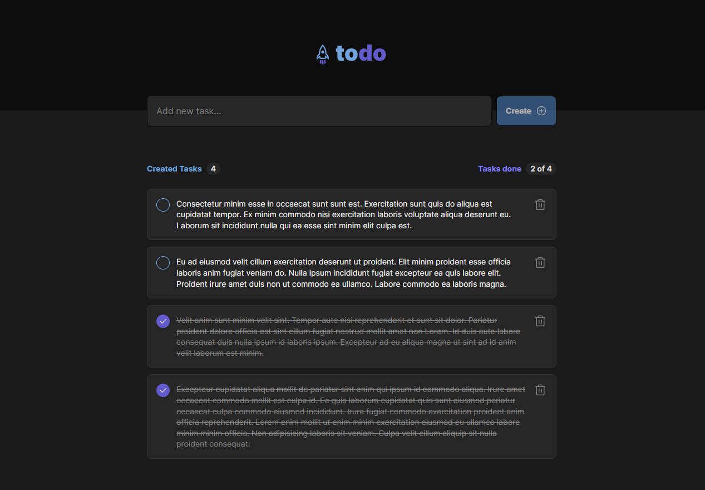

### Describe high level design

Show the main note app components and the logical interactions that will fulfill the requirements.

- The note app will consist of a header where we will display the logo and a main body where we will display the list
  of notes, input element, a create button and a radio button to scratch out notes that are no longer required.
- The logical interactions will be:
    - an input element and create button next to each other where users will type up their notes or todos and click on
      create to add it to the list.
    - a list of notes that and then each note has a delete button, so it can be deleted
    - each note can be strikethrough to show it is no longer applicable.

### Web App UI

Provide a wireframe design of the note web app that will fulfill the requirements.
Consider what UI components are required and how these interact with the other components.
What (if any) validation is required?

Please see the image below for details on how the note app will look like in concept:

UI components:

- Create Button - for saving a new note
- Delete Button - on each note to delete the note
- Radio Button - for making a note no longer applicable
- Input - where user will type up text
- Note List - where the note will be displayed
- Header - where logo will be displayed

Validation:

- User will not be able to create an empty note therefore the input element must be filled with text when clicking on
  create button, otherwise we won't allow the note to be added.
- Input field will be required by default.

### Data Model

Describe how a note will be modelled consider the required properties
The note app will be using MongoDB as a database choice because the data is not relationship heavy therefore looking at
the scope of this project I believe MongoDB is a good choice.

The collection will be named `note` would require the following fields:

`{
id: uuid,
content: string,
checked: boolean
}`

The `content` will be used for storing the `note text` and the `checked` will be used for tracking if note is no longer
applicable.

### Restful API

Describe the Restful API required to fulfill the note app.
how would the web app get the user’s notes?
how would the web app save a user note?
what are the URL for the note resource(s)?
and verbs to expose the actions?

These will be the endpoints required to create, delete and get notes. The backend would be created with Java Spring Boot
and it would have the 4 endpoints below. There will be validation on all endpoints but essentially the app will need to
make HTTP call to the endpoints below to execute different functions as the user interacts with the app.

- **POST /notes** - create note

  HTTP STATUS 200, 400
  `{
  content: string,
  checked: boolean
  }`
- **DELETE /notes/{noteId}** - delete note

  HTTP STATUS 204, 400, 404

- **GET /notes** - get a list of notes

  HTTP STATUS 200
  `[{
  id: uuid,
  content: string,
  checked: boolean
  }]`
- **UPDATE /notes/{noteId}** - update note

  HTTP STATUS 200, 400, 404
  `{
  checked: boolean
  }`

### Web Server

Describe how the webserver implements that Restful API:
consider how each action will be implemented
what (if any) business logic is required?
how are the notes saved?

The backend app will have Presentation Layer(Controller), Business Layer(Services) and Data Layer(Repository) using the
N-Tier architecture. We will make use of Spring Validation, Spring Web, Spring Data MongoDB and MongoDB Driver so that
we can implement all layers.

There will be need for DTOs so the controller will receive the DTO and pass it a long to the service as we should not
have our entity exposed to the controller. At the service layer is where we will implement the logic to handle
exceptions and communicate with the repository.

The approach will be a mixture of OOP and Functional Programming where applicable.

Whenever modifying a resource at data layer we will need to carry out checks to see if resource exists and handle
exceptions by implementing an Exception Controller, there we will handle application errors or even JSON parsing errors.

When an exception is thrown we will make use of ProblemDetail that comes with Spring Web by default, as this follows
this rfc https://datatracker.ietf.org/doc/html/rfc7807 for HTTP standard way fo responses.